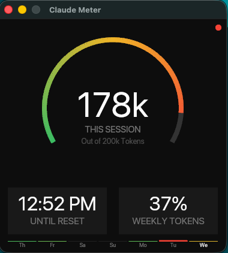

# Claude Meter

A macOS desktop app that shows your [Claude Code](https://claude.ai/code) token usage in real time.



## Features

- **Session arc** — animated gauge showing tokens used in the current session (200k cap), with a smooth green → yellow → red gradient
- **Until Reset** — absolute local time when the 5-hour rate-limit window resets
- **Weekly Tokens** — percentage of the weekly token budget used across all projects (1.8M cap)
- **7-day sparkline** — daily token usage bar chart for the past week
- **Live updates** — refreshes every 2 seconds; heartbeat dot pulses on each tick

All data is read directly from `~/.claude/` — no network calls, no API keys.

## Requirements

- macOS 12+
- [Rust](https://rustup.rs/) (stable toolchain)

## Compile

```bash
cargo build --release
```

The binary will be at `target/release/claude_meter`. You can run it directly:

```bash
./target/release/claude_meter
```

## Build & Install as a macOS App

`build-app.sh` compiles a release binary and packages it as a proper `.app` bundle:

```bash
bash build-app.sh
```

This produces `Claude Meter.app` in the project directory. To install:

```bash
cp -r "Claude Meter.app" ~/Applications/
```

Then launch from Spotlight, Launchpad, or:

```bash
open ~/Applications/"Claude Meter.app"
```

## How It Works

Claude Code writes conversation history to `~/.claude/projects/<project>/<session>.jsonl`. Each assistant message contains a `usage` object with `input_tokens` and `output_tokens`. Claude Meter scans all JSONL files on every refresh to compute session and weekly totals.

The 5-hour reset countdown is derived from `~/.claude/history.jsonl`, which records the timestamp of every prompt submitted.
